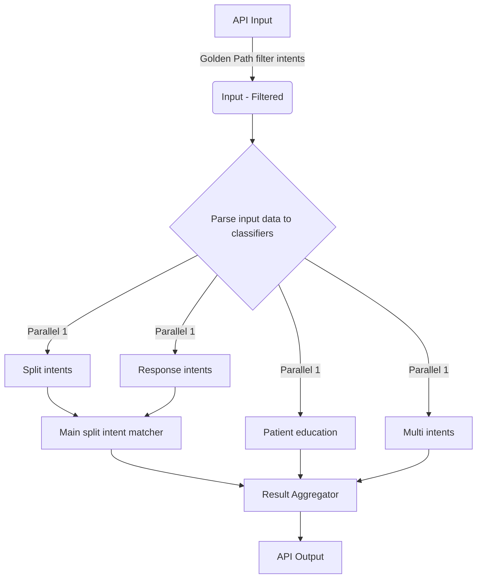

# Overall Goal 
Create an "orchestrator" API that when called is starting x number of llm based classifiers in parallel merges the results and returns the merged result. Each classifier should be it's own seperate component.

## overview
The input of the API can be found below. It is important, that the input format is followed, if not it should return an error. First component before triggering the classifiers should be a filter, that filters intents based on the golden path.

When the API is called it should trigger the four LLM based classifiers in parallel. Each of the classifiers should be it's own component in folders. In there should be a file where all the four classifiers are triggered, giving an overview over which classifiers are being used. It should be modular, so adding or removing classifiers should be easy. Please use langchain to create classifiers together with Pydanic AI to control the formats and then langsmith for tracing. 

See flow below. 

## Components
There are multiple types of components: golden path filter, classifiers, main split intent matcher and ResultAggregator (AKA the "Combiner"). Below is a detailed description of each component

### Golden path filter
Right after the API has received the correctly formatted Input, it is parsed through the Golden path filter. The fil

##
## API
### API - classifier/

API input:
{

    "user_input": "<what user said>",

    "persona_id" "<ID for persona>",

    “history”: “<conversation history>”,

    “user_id”: “<user id>”,

    “prev_recognized_sub_intents”: 
        {

            “<main intent ID with matched sub intents>“: <list of sub intent IDs previously matched>,

            “<main intent ID 2 with matched sub intents>“: <list of sub intent IDs previously matched>

        },

    “golden_path”: ["identifyPatient", "askQuestion924", "askQuestion100","askQuestion103", "
    "askQuesti"],
}

Output:
{

    “all_intents_recognized”: <list of all intent IDs recognized>,

    “split_intents_recognized”: 
        {

            “main_intent recognized: <list of sub intents recognized>

            “sub intents?”

            “reason” ?
        }

    “multi_intents”: <List of intents recognized>

    “single_intent”: 

    “response_intents”: 

}

### Building Requirements:
- **Package Management**: Use UV for package management and virtual environment. Use pyproject.toml for dependency management
- **LLM Integration**: Use LangChain to make the structured outputs and semantic matching
- **API Framework**: Use FastAPI to create the classification endpoint
- **LLM Connection**: Use the existing src/llm_setup.py for Azure OpenAI connection
- **Code Organization**: Divide the application into separate .py files for modular components

#### Suggested Architecture:
1. **models.py** - Pydantic models for request/response validation
2. **classifier.py** - Core dual intent classification logic
3. **conversation_processor.py** - Conversation history processing and selection
4. **dual_intent_loader.py** - Load and manage dual intents from JSON
5. **main.py** - FastAPI application and API endpoints
6. **config.py** - Configuration management and constants
