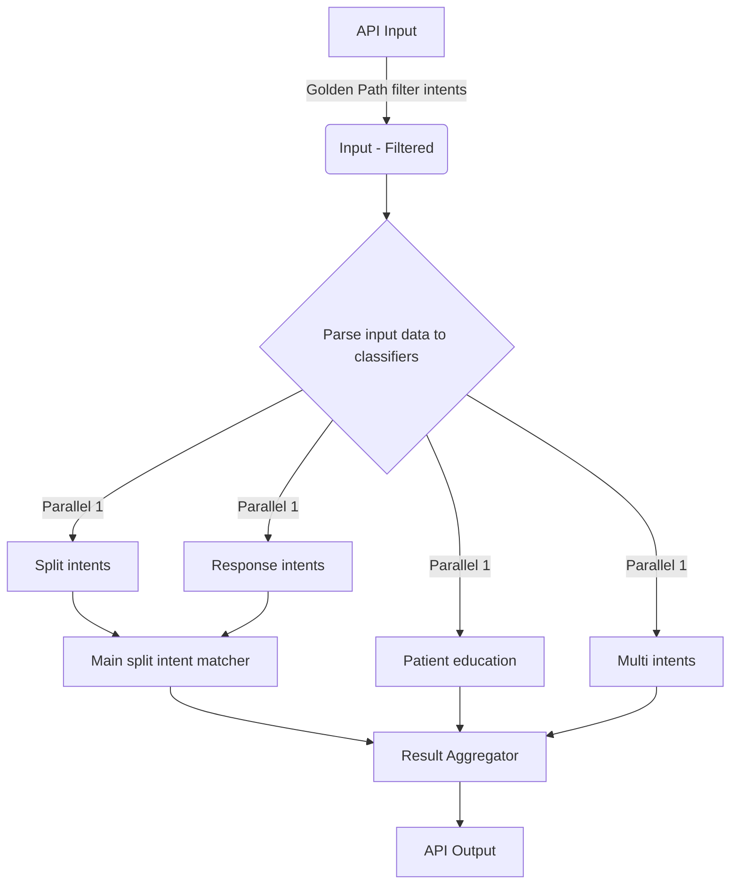

# Overall Goal 
Create an "orchestrator" API that when called is starting x number of llm based classifiers in parallel merges the results and returns the merged result. Each classifier should be it's own seperate component.

## overview
The input of the API can be found below. It is important, that the input format is followed, if not it should return an error. First component before triggering the classifiers should be a filter, that filters intents based on the golden path.

When the API is called it should trigger the four LLM based classifiers in parallel. Each of the classifiers should be it's own component in folders. In there should be a file where all the four classifiers are triggered, giving an overview over which classifiers are being used. It should be modular, so adding or removing classifiers should be easy. Please use langchain to create classifiers together with Pydanic AI to control the formats and then langsmith for tracing. 

See flow below. 

## Components
There are multiple types of components: golden path filter, classifiers, main split intent matcher and ResultAggregator (AKA the "Combiner"). Below is a detailed description of each component

### Golden path filter
Right after the API has received the correctly formatted Input, it is parsed through the Golden path filter. The filter should filter for all the intent ID in the golden_path input with the intent configs used in the classifiers, so it should filter the following configs split-intents.json, intents.json and intent-responses.json, before parsing them into the classifiers.  

### Classifiers
See the files Tasks/classifier_multi-intents.md, Tasks/classifier_split-intents.md, Tasks/classifier_response-intents.md and Tasks/classifier_patient-edication.md for a detailed description of the components.

### split intent matcher
The split intent matcher job is to take in the output from the split-intens classifier and the response intents classifier together with the api intput “prev_recognized_sub_intents”. It should then check if the added sub-intents from the two classifiers makes up a Main intent pair. A fully matched main intent is when all the sub intents of a main split intent has been recognized (the list of split-intents can be found in the configs/split-intents.json).

Take the following example:

configs/split-intents.json: {
    "ID_ALLERGIES: Do you have any allergies? If so, what kind of reaction did you have?": {
        "ID_ALLERGIES_sub-intent_1": [
            "Do you have any allergies?",
            "Have you ever experienced an allergic reaction?",
            "Are you allergic to any medications, foods, or substances?"
        ],
        "ID_ALLERGIES_sub-intent_2": [
            "If yes, what kind of reaction did you have?",
            "Can you describe the allergic reaction you experienced?",
            "What symptoms did you notice when the reaction occurred?",
            "What happens when you're exposed to that allergen?"
        ]
    },
    "ID_NAME_DOB: Please state your name and date of birth.": {
        "ID_NAME_DOB_sub-intent_1": [
            "Please tell me your full name.",
            "May I have your name?",
            "What is your name?"
        ],
        "ID_NAME_DOB_sub-intent_2": [
            "What is your date of birth?",
            "When were you born?",
            "Can you provide your birth date?"
        ]
    },
    "ID_COLOS_PAIN: Have there been any pain, swelling or miscolorization around the colostomy pouch?": {
        "ID_COLOS_PAIN_sub-intent_1": [
            "Have you had any pain around the colostomy pouch?",
            "Is there any discomfort or tenderness near the pouch?",
            "Do you feel any pain at the stoma site?"
        ],
        "ID_COLOS_PAIN_sub-intent_2": [
            "Have you noticed any swelling or discoloration around the pouch?",
            "Has the skin around the stoma become swollen or changed color?",
            "Any redness, swelling, or unusual color at the colostomy site?"
        ]
    },
}

"prev_recognized_sub_intents": {
    "ID_NAME_DOB":["ID_NAME_DOB_sub-intent_1"],
    "ID_ALLERGIES": ["ID_ALLERGIES_sub-intent_1", "ID_ALLERGIES_sub-intent_2"]
}

The outputs from the split_intent and response intent classifier for matched sub intents: ["ID_NAME_DOB_sub-intent_2", ""ID_ALLERGIES_sub-intent_1", "ID_COLOS_PAIN_sub-intent_2"]

In this case the split intent matcher should make the following match and append to the prev_recognized_sub_intents.

New Main split intents matched: ["ID_NAME_DOB"]
"prev_recognized_sub_intents": {
    "ID_NAME_DOB":["ID_NAME_DOB_sub-intent_1","ID_NAME_DOB_sub-intent_2"],
    "ID_ALLERGIES": ["ID_ALLERGIES_sub-intent_1", "ID_ALLERGIES_sub-intent_2"],
    "ID_COLOS_PAIN": ["ID_COLOS_PAIN_sub-intent_2"]
}

As you can see it only matched the new main split intent ID_NAME_DOB, eventhough all sub intents for ID_ALLERGIES was also there, but since they were in the prev_recognized_sub_intents, this means that the main split intent ID_ALLERGIES has previously been recognized and should therefore, not be added as a new match. New matches should only be if at least one of the sub intents are newly classified. 

##
## API
### API - classifier/

API input:
{

    "user_input": "<what user said>",

    "persona_id" "<ID for persona>",

    “history”: “<conversation history>”,

    “user_id”: “<user id>”,

    “prev_classified_sub_intents”: 
        {

            “<main intent ID with matched sub intents>“: <list of sub intent IDs previously matched>,

            “<main intent ID 2 with matched sub intents>“: <list of sub intent IDs previously matched>

        },

    “golden_path”: ["identifyPatient", "askQuestion924", "askQuestion100","askQuestion103", "
    "askQuesti"],
}

Output:
{
    “intents_classified”: <list of all new intent IDs recognized>,
    "classified_sub_intents": # Used for client to send back in “prev_classified_sub_intents”
        {
            “<main intent ID with matched sub intents>“: <list of sub intent IDs previously matched>,
            “<main intent ID 2 with matched sub intents>“: <list of sub intent IDs previously matched>
        },
    "classification_details": {
        “split_intents_classified”: 
            {
                “sub_intents”: "<list of classified sub-intents>
                “reason”: "<classifier reason>"
            }

        “multi_intents”: {
            "intents": "<list of matched intent IDs>",
            "reasion": "<classifer reason>"
        },
        “single_intent”:  {
            "intents": "<list of matched intent IDs>",
            "reasion": "<classifer reason>"
        },
        “response_intents”:  {
            "intents": "<list of matched intent IDs>",
            "reasion": "<classifer reason>"
        }
    }
}

### Building Requirements:
- **Package Management**: Use UV for package management and virtual environment. Use pyproject.toml for dependency management
- **LLM Integration**: Use LangChain to make the structured outputs and semantic matching
- **API Framework**: Use FastAPI to create the classification endpoint
- **LLM Connection**: Use the existing src/llm_setup.py for Azure OpenAI connection
- **Code Organization**: Divide the application into separate .py files for modular components

#### Suggested Architecture:
1. **models.py** - Pydantic models for request/response validation
2. **classifier.py** - Core dual intent classification logic
3. **conversation_processor.py** - Conversation history processing and selection
4. **dual_intent_loader.py** - Load and manage dual intents from JSON
5. **main.py** - FastAPI application and API endpoints
6. **config.py** - Configuration management and constants
